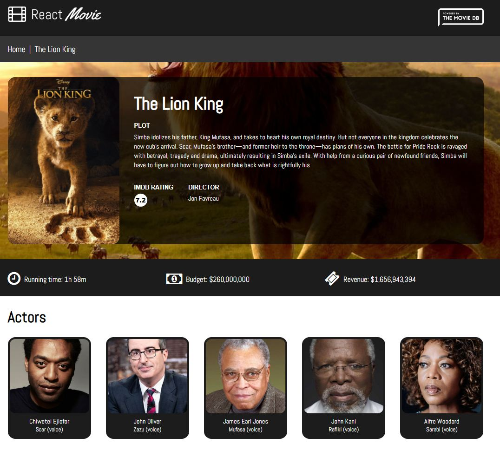
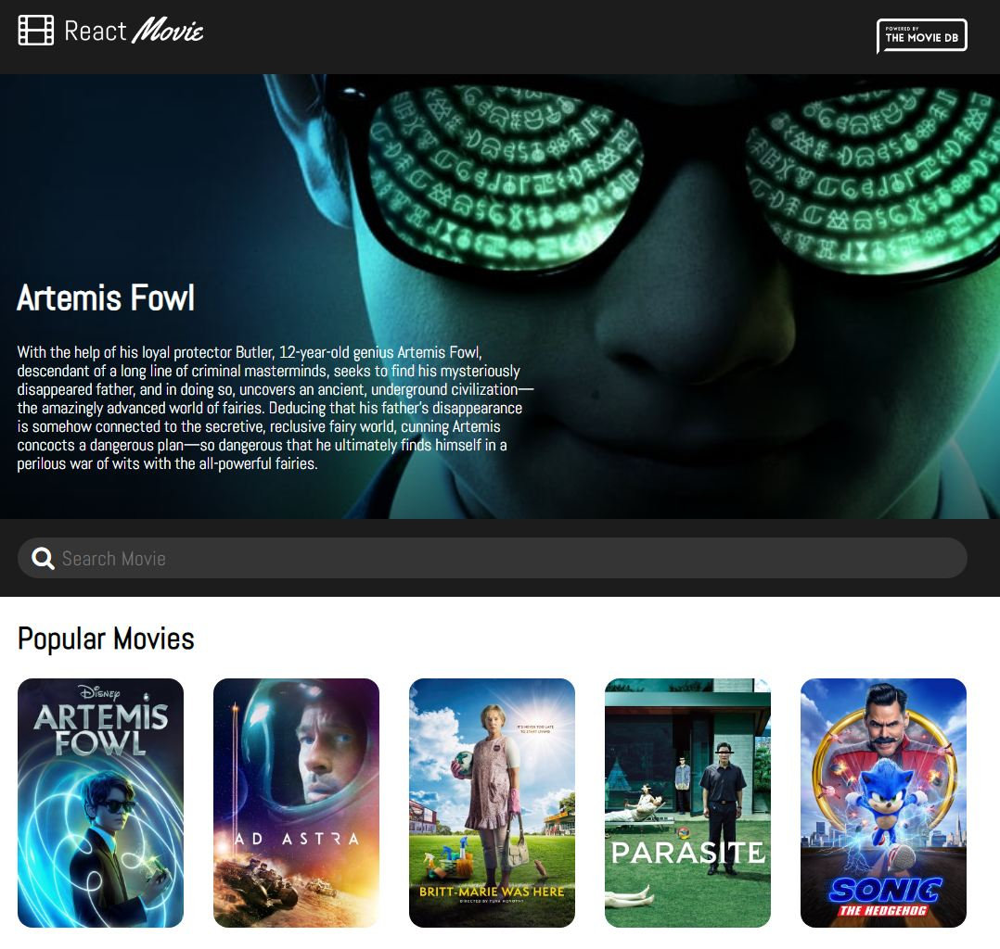

# Table of contents

1. [react-movie-db](#react-movie-db)
2. [Setup](#Setup)

## react-movie-db
Web app that let us look for movie information.






App is deployed on netlify web hosting server https://liemdepzai.netlify.app

Technology and tools in use: 

- [ReactJS](https://reactjs.org)
- [React Router](https://reacttraining.com/react-router)
- [Create react app](https://create-react-app.dev)
- [Styled Component](https://styled-components.com)

## Setup

Prerequisites: 

- [Nodejs](https://nodejs.org/en/)
- [NPM](https://www.npmjs.com)

Run the following command at project's root directory to setup environment

```shell script
$ npm install
```

To run application locally

```shell script
$ npm run start
```

To build application for production usage
```shell script
npm run build
```
